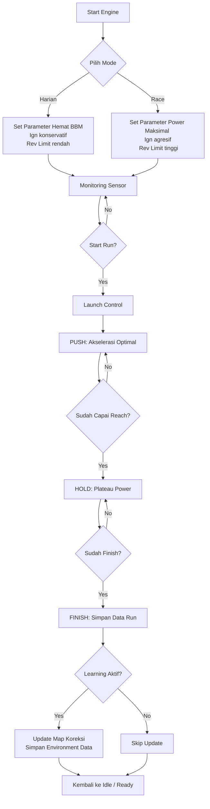

# 🏍️ 2stroke-ecu — Adaptive Drag ECU (ESP32)

Firmware **ECU Injeksi 2-Tak** berbasis **ESP32**, dirancang khusus untuk **drag race / time attack**.
Fokus utama: **time sesingkat mungkin → tenaga keluar secepat mungkin → dipertahankan sampai finish**.

---

## 🚀 Konsep Utama

### 1. Only-Push → Auto-Reach → Hold

* **Only-Push**: ECU memaksa mesin mengeluarkan tenaga secepat mungkin sejak launch.
* **Auto-Reach**: ECU mendeteksi kapan **tenaga puncak tercapai** (berdasarkan akselerasi & kecepatan).
* **Hold**: ECU menahan power band di level optimal agar tidak ngempos sampai finish.

### 2. Full Adaptive Mapping

* ECU **belajar dari setiap run**.
* Ada 2 layer:

  * **CO (Core Overlay)** → mapping dasar steril, stabil.
  * **ED (Environment Delta)** → koreksi adaptif berdasarkan kondisi lingkungan (suhu, tekanan, kelembaban).

### 3. Pit Adapt

* Tanpa harus test run, ECU bisa **menyesuaikan kondisi lingkungan** cukup dengan idle & rev test di pit.
* Jadi run pertama di lintasan **sudah kompetitif**.

---

## ⚙️ Alur Kerja ECU

| Tahap             | Mekanisme                                                                               | Output ke Mesin              |
| ----------------- | --------------------------------------------------------------------------------------- | ---------------------------- |
| **1. ARM**        | ECU siap, sensor dibaca, profile lingkungan di-load.                                    | Idle stabil                  |
| **2. LAUNCH**     | Throttle WOT, ECU aktifkan **launch enrich** (dorongan bahan bakar + ignition advance). | Fuel +5–10%, ign +0.3–0.7°   |
| **3. PUSH**       | Mesin dipaksa ke top speed secepat mungkin.                                             | Koreksi real-time fuel/ign   |
| **4. AUTO-REACH** | ECU mendeteksi puncak tenaga tercapai (dari akselerasi melandai).                       | Switch mode → HOLD           |
| **5. HOLD**       | ECU menjaga tenaga tetap stabil (plateau).                                              | Koreksi kecil, fuel trim ±2% |
| **6. FINISH**     | ECU catat hasil run, update database pengalaman.                                        | Lepas kontrol (idle kembali) |

---

## 🧠 Mekanisme Adaptive Learning

* **CO (Core Overlay)**

  * Peta dasar TPS × RPM × Fuel/Ign.
  * Stabil, tidak berubah saat race.
* **ED (Environment Delta)**

  * Koreksi sementara.
  * Berdasarkan sensor lingkungan (IAT, Baro, RH).
  * Disimpan sebagai pengalaman baru → makin sering dipakai makin akurat.

### Contoh Koreksi ED

| Kondisi Lingkungan | Koreksi Fuel | Koreksi Ignition |
| ------------------ | ------------ | ---------------- |
| IAT naik +10 °C    | +3% fuel     | −0.1°            |
| Baro turun −10 kPa | +6% fuel     | −0.3°            |
| RH naik +20%       | +2% fuel     | 0°               |

---

## 🛡️ Safety Guard

ECU melindungi mesin dari kerusakan:

| Sensor       | Batas Aman | Aksi Koreksi                    |
| ------------ | ---------- | ------------------------------- |
| **EGT**      | 780 °C     | +5% fuel, −1° ign               |
| **CHT**      | 110 °C     | +5% fuel, −1° ign               |
| **Duty Inj** | 85%        | Batasi fuel (tidak tambah lagi) |

---

## 🔍 Sensor & Fungsinya

| Sensor                 | Fungsi Utama                                       | Dampak ke ECU                                                 |
| ---------------------- | -------------------------------------------------- | ------------------------------------------------------------- |
| **MAP / TPS**          | Input beban mesin                                  | Fuel base map                                                 |
| **Crank (VR/Hall)**    | RPM & fase mesin                                   | Timing injeksi & pengapian                                    |
| **EGT**                | Monitor suhu gas buang (indikator AFR & timing)    | Koreksi safety (fuel enrich, retard ign)                      |
| **CHT**                | Monitor suhu head                                  | Safety koreksi                                                |
| **IAT**                | Suhu udara masuk                                   | ED trim (koreksi fuel & ign)                                  |
| **Baro**               | Tekanan udara (ketinggian)                         | ED trim                                                       |
| **RH Sensor**          | Kelembaban udara                                   | ED trim (bakar lebih sulit → tambah fuel)                     |
| **GPS**                | Hitung speed, distance, time trap                  | Auto-Reach detector & mapping distance                        |
| **IMU (MPU6050/9250)** | Tambahan akurasi akselerasi & deteksi wheelie/spin | Data koreksi tambahan (opsional, bisa diabaikan untuk simpel) |

---

## 📊 Flowchart Singkat

```text
Key-On → Pit Adapt (idle + rev test) → Load Profile → ARM
 ↓
Throttle WOT → LAUNCH enrich
 ↓
PUSH (Only-Push mode, max accel)
 ↓
AUTO-REACH (deteksi top power)
 ↓
HOLD (plateau power band)
 ↓
FINISH → Simpan hasil → Update database pengalaman
```

---

## 📈 Base Map Dummy (TPS × RPM)

### Grid 1: Fuel (ms pulse width)

| TPS\RPM | 2000 | 4000 | 6000 | 8000 | 10000 | 12000 |
| ------- | ---- | ---- | ---- | ---- | ----- | ----- |
| 10%     | 2.1  | 2.3  | 2.5  | 2.8  | 3.0   | 3.1   |
| 30%     | 2.5  | 2.9  | 3.5  | 4.1  | 4.6   | 4.8   |
| 50%     | 3.0  | 3.7  | 4.6  | 5.5  | 6.3   | 6.8   |
| 70%     | 3.6  | 4.5  | 5.8  | 6.9  | 7.8   | 8.4   |
| 100%    | 4.2  | 5.4  | 7.1  | 8.5  | 9.7   | 10.5  |

---

### Grid 2: Ignition (BTDC °)

| TPS\RPM | 2000 | 4000 | 6000 | 8000 | 10000 | 12000 |
| ------- | ---- | ---- | ---- | ---- | ----- | ----- |
| 10%     | 12°  | 14°  | 16°  | 18°  | 19°   | 20°   |
| 30%     | 14°  | 16°  | 18°  | 20°  | 21°   | 22°   |
| 50%     | 15°  | 17°  | 19°  | 21°  | 22°   | 23°   |
| 70%     | 16°  | 18°  | 20°  | 22°  | 23°   | 24°   |
| 100%    | 17°  | 19°  | 21°  | 23°  | 24°   | 25°   |

---

## ⚡ Integrasi Lookup di Kode

```cpp
float baseFuelMsEstimate(int tps, int rpm);
float baseIgnDegEstimate(int tps, int rpm);
```

* `baseFuelMsEstimate()` → ambil nilai fuel pulse (ms).
* `baseIgnDegEstimate()` → ambil sudut pengapian (° BTDC).
* Lookup menggunakan **linear interpolation** antar grid.

---

## 🖥️ Log Output (Simulator)

```
st=2 v=80.4 s=64.5 rpm=9500 fuel=8.2ms ign=22.3° fuel×=1.06 ign+=0.2 EGT=710 CHT=95
```

**Artinya**:

* Mesin di state PUSH.
* Speed 80 km/h, jarak 64 m, rpm 9500.
* Fuel base 8.2 ms → final setelah koreksi.
* Ignition 22.3° BTDC.
* Trims: +6% fuel, +0.2° ignition.

---

## 📜 Kesimpulan

`2stroke-ecu` bukan sekadar piggyback, tapi **mini-ECU adaptif**:

* Bisa dipakai harian, bisa dipakai race.
* Bisa belajar terus menerus.
* Bisa prediksi & koreksi otomatis sesuai lingkungan.
* Cocok buat **drag bike / time attack** di lintasan lurus.

---

# 📑 Contoh Konfigurasi Profile Map Drag

ECU bisa punya **multi-map profile**, tinggal dipilih sesuai event (200m, 400m, 1000m).
Base map tetap sama, tapi **target power delivery beda**.

---

## 1️⃣ Map 200m (Short Distance / Sprint)

* **Target**: Tenaga penuh **sebelum 170m**, lalu ditahan sampai finish.
* **Strategi**:

  * Push lebih agresif (rich + advance).
  * Reach window lebih cepat.
  * Hold mulai sekitar 170m.

### Logika

```
if distance < 170m → PUSH (dorong habis-habisan)
if 170m ≤ distance < 200m → HOLD (plateau power)
if ≥200m → FINISH
```

---

## 2️⃣ Map 400m (Standard Drag)

* **Target**: Tenaga penuh **di sekitar 350m**, tahan sampai 400m.
* **Strategi**:

  * Push lebih smooth (supaya tidak habis tenaga terlalu cepat).
  * Reach window lebih lebar.
  * Launch enrich lebih singkat.

### Logika

```
if distance < 300m → PUSH (akselerasi optimal)
if 300m ≤ distance < 400m → HOLD (power stabil)
if ≥400m → FINISH
```

---

## 3️⃣ Map 1000m (Long Distance / High Speed)

* **Target**: Top speed dicapai **di sekitar 900m**, tahan sampai 1000m.
* **Strategi**:

  * Push lebih bertahap (jaga mesin tidak overheat).
  * Launch enrich kecil, ignition lebih konservatif.
  * Fokus stabilitas power band panjang.

### Logika

```
if distance < 800m → PUSH (akselerasi terkendali)
if 800m ≤ distance < 1000m → HOLD (plateau)
if ≥1000m → FINISH
```

---

## 📊 Perbandingan Profile Map

| Profile | Target Reach | Launch Enrich | Push Style | Hold Start | Finish |
| ------- | ------------ | ------------- | ---------- | ---------- | ------ |
| 200m    | \~170m       | Tinggi        | Agresif    | 170m       | 200m   |
| 400m    | \~350m       | Medium        | Optimal    | 300m       | 400m   |
| 1000m   | \~900m       | Rendah        | Bertahap   | 800m       | 1000m  |

---

## ⚡ Implementasi di Kode (Dummy)

```cpp
struct DragProfile {
    int targetDistance;
    int reachOffset;   // jarak sebelum finish untuk capai top power
};

DragProfile map200 = {200, 30};   // top power 170m
DragProfile map400 = {400, 50};   // top power 350m
DragProfile map1000 = {1000, 100}; // top power 900m

DragProfile currentProfile = map200; // default
```

👉 Dengan ini ECU otomatis tau **berapa meter sebelum finish harus capai tenaga penuh**.
Kalau ganti map tinggal set `currentProfile`.

---

## 🖥️ Contoh Log 200m Map

```
st=2 v=115.3 s=168.0 rpm=11850 fuel=9.6ms ign=22.5° (PUSH)
st=3 v=142.1 s=190.3 rpm=12000 fuel=9.8ms ign=22.7° (HOLD)
st=4 v=150.0 s=200.0 rpm=12000 fuel=9.8ms ign=22.7° (FINISH)
```

➡ Mesin capai tenaga penuh **di 170m**, stabil sampai finish di 200m → ideal.

---

# 📈 Diagram Power Curve per Profile

Diagram ini nunjukin bagaimana **tenaga (power output)** dilepas terhadap **jarak (meter)**.
Setiap profile punya karakteristik berbeda:

---

## 1️⃣ Map 200m (Sprint)

* Power **naik cepat** → capai puncak di ±170m.
* Stabil sebentar, finish di 200m.
* Cocok buat **drag pendek** (time attack).

```
Power ^
       |         ________
       |        /
       |  _____/
       |
       +---------------------> Distance
            170m     200m
```

---

## 2️⃣ Map 400m (Standard Drag)

* Power naik **lebih smooth**.
* Puncak dicapai di ±350m.
* Stabil sampai finish 400m.

```
Power ^
       |            _______
       |           /
       |      ____/
       |
       +---------------------> Distance
                 350m   400m
```

---

## 3️⃣ Map 1000m (High Speed)

* Power **naik bertahap** → biar mesin awet & gak panas.
* Puncak dicapai di ±900m.
* Stabil panjang sampai 1000m.

```
Power ^
       |                      ______
       |                     /
       |                ____/
       |
       +-------------------------------> Distance
                          900m   1000m
```

---

## 📊 Ringkasan Strategi

| Profile | Target Reach | Karakter Power         | Kelebihan                 |
| ------- | ------------ | ---------------------- | ------------------------- |
| 200m    | ±170m        | Naik cepat, agresif    | Time attack, short drag   |
| 400m    | ±350m        | Naik smooth, stabil    | Standard drag             |
| 1000m   | ±900m        | Naik bertahap, panjang | High-speed endurance drag |

---

## ⚡ Implikasi ke ECU

* **200m** → koreksi fuel/ign lebih agresif, launch enrich besar.
* **400m** → moderate, lebih seimbang antara power & stabilitas.
* **1000m** → konservatif, jaga suhu & efisiensi.

---


# 🖥️ Flow Simulasi Real-Time Log

Simulasi ini nunjukin output ECU saat run berlangsung:

* `st` → state (1=LAUNCH, 2=PUSH, 3=HOLD, 4=FINISH)
* `v` → kecepatan (km/h)
* `s` → jarak tempuh (m)
* `rpm` → putaran mesin
* `fuel` → durasi injektor (ms)
* `ign` → sudut pengapian (° BTDC)

---

## 1️⃣ Map 200m (Sprint)

```
t=0.3s st=1 v=8.2 s=2.1 rpm=4500 fuel=4.8ms ign=15.2° (LAUNCH enrich)
t=0.7s st=2 v=52.4 s=40.0 rpm=8500 fuel=7.6ms ign=20.1° (PUSH)
t=1.2s st=2 v=98.5 s=120.5 rpm=11000 fuel=9.0ms ign=22.0° (PUSH)
t=1.5s st=3 v=135.2 s=170.1 rpm=12000 fuel=9.5ms ign=22.7° (HOLD plateau)
t=1.7s st=4 v=150.0 s=200.0 rpm=12000 fuel=9.6ms ign=22.8° (FINISH)
```

➡ Power **naik cepat**, puncak tercapai di ±170m, finish stabil di 200m.

---

## 2️⃣ Map 400m (Standard Drag)

```
t=0.3s st=1 v=7.9 s=2.0 rpm=4400 fuel=4.7ms ign=15.1° (LAUNCH enrich)
t=0.8s st=2 v=60.2 s=50.0 rpm=8900 fuel=7.8ms ign=20.3° (PUSH)
t=1.5s st=2 v=105.3 s=180.2 rpm=10500 fuel=8.7ms ign=21.5° (PUSH)
t=2.5s st=2 v=148.0 s=300.0 rpm=11800 fuel=9.5ms ign=22.6° (PUSH)
t=3.0s st=3 v=158.0 s=350.0 rpm=12000 fuel=9.6ms ign=22.8° (HOLD plateau)
t=3.3s st=4 v=160.0 s=400.0 rpm=12000 fuel=9.6ms ign=22.8° (FINISH)
```

➡ Power **smooth**, top speed dicapai di 350m, stabil sampai finish 400m.

---

## 3️⃣ Map 1000m (High Speed)

```
t=0.3s st=1 v=7.5 s=1.8 rpm=4300 fuel=4.6ms ign=15.0° (LAUNCH enrich low)
t=1.0s st=2 v=55.0 s=70.0 rpm=8500 fuel=7.3ms ign=19.8° (PUSH gradual)
t=2.5s st=2 v=110.0 s=300.0 rpm=10500 fuel=8.5ms ign=21.3° (PUSH gradual)
t=5.0s st=2 v=145.0 s=700.0 rpm=11500 fuel=9.2ms ign=22.2° (PUSH gradual)
t=6.0s st=3 v=160.0 s=900.0 rpm=12000 fuel=9.6ms ign=22.8° (HOLD plateau)
t=6.7s st=4 v=162.0 s=1000.0 rpm=12000 fuel=9.6ms ign=22.8° (FINISH)
```

➡ Power **naik bertahap**, puncak dicapai ±900m, stabil panjang sampai 1000m.

---

## 📊 Insight dari Log

* **200m** → akselerasi brutal, tenaga harus **keluar sebelum 170m**.
* **400m** → akselerasi optimal, tenaga puncak **350m** → lebih smooth.
* **1000m** → akselerasi terkendali, tenaga puncak **900m**, cocok buat high-speed.

---

# 🏍️ Mode Harian vs Mode Race

ECU ini bisa dipakai untuk **2 mode utama**:

1. **Mode Harian (Daily Ride)** → efisiensi, durabilitas, nyaman dipakai.
2. **Mode Race (Drag / Time Attack)** → performa maksimal, full adaptif.

---

## ⚡ Mode Harian (Daily Ride)

* **Target**:

  * Konsumsi BBM lebih irit.
  * Mesin awet (tidak selalu di RPM tinggi).
  * Power delivery smooth (tidak agresif).

* **Strategi ECU**:

  * **Fuel Trim** → lean +5% (hemat BBM).
  * **Ignition** → advance konservatif (hindari knocking).
  * **Rev Limit** → lebih rendah (misal 9500 rpm).
  * **Launch Enrich** → kecil (smooth start).
  * **Proteksi** → lebih ketat (EGT/CHT sensitif).

* **Kelebihan**: mesin adem, bensin irit, cocok buat jalanan sehari-hari.

---

## 🔥 Mode Race (Drag / Time Attack)

* **Target**:

  * Akselerasi maksimal, capai top speed secepat mungkin.
  * ECU adaptif → belajar dari setiap run.
  * Optimasi jarak tertentu (200m, 400m, 1000m).

* **Strategi ECU**:

  * **Fuel Trim** → rich +5\~10% (jaga power & pendinginan).
  * **Ignition** → advance agresif (maksimalkan torsi).
  * **Rev Limit** → lebih tinggi (misal 12000 rpm+).
  * **Launch Enrich** → besar (dorong start kuat).
  * **Proteksi** → lebih longgar (mesin dipaksa kerja maksimal).

* **Kelebihan**: waktu tempuh jauh lebih singkat, performa optimal untuk drag race.

---

## 📊 Perbandingan Mode

| Parameter       | Harian (Daily)         | Race (Drag/Time Attack) |
| --------------- | ---------------------- | ----------------------- |
| Fuel Trim       | Lean (hemat BBM)       | Rich (tenaga maksimal)  |
| Ignition Timing | Konservatif            | Agresif                 |
| Rev Limit       | 9500 rpm               | 12000+ rpm              |
| Launch Enrich   | Kecil (smooth)         | Besar (dorongan awal)   |
| Proteksi Suhu   | Ketat (EGT/CHT rendah) | Longgar (tahan panas)   |
| Power Delivery  | Smooth                 | Brutal / Maksimal       |

---

## 🚦 Switching Mode

ECU bisa ganti mode via:

* **Tombol input** di handlebar, atau
* **Serial command / Bluetooth** (misal pakai app di HP).

Saat mode diganti, **base map tetap sama**, tapi strategi koreksi berubah sesuai mode.

---

# 🔄 Flowchart Kerja ECU

Berikut alur kerja ECU mulai dari mesin nyala → mode dipilih → run → learning:



---

## 📊 Penjelasan Flow

1. **Start Engine** → ECU aktif, sensor mulai baca.
2. **Pilih Mode**:

   * Harian → fokus efisiensi & durability.
   * Race → fokus performa & time attack.
3. **Monitoring Sensor** → ECU baca GPS, RPM, TPS, EGT, IAT, dsb.
4. **Start Run** → ECU masuk mode drag.
5. **Launch Control** → ekstra fuel + ignition advance di detik awal.
6. **PUSH** → akselerasi maksimal, ECU dorong power.
7. **Reach Window** → ECU deteksi titik puncak tenaga sesuai map.
8. **HOLD** → ECU tahan power stabil sampai finish.
9. **FINISH** → ECU rekam hasil run (time, distance, top speed).
10. **Learning** → jika aktif, ECU update koreksi map & simpan data lingkungan.
11. Kembali **Idle/Ready** → siap untuk run berikutnya.

---
